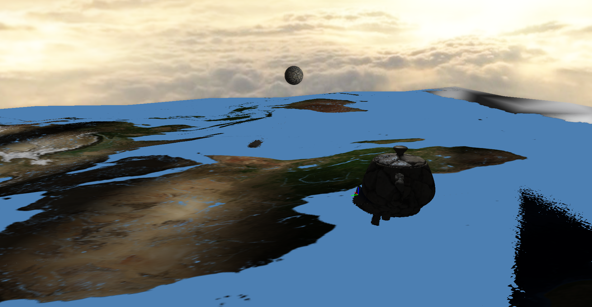
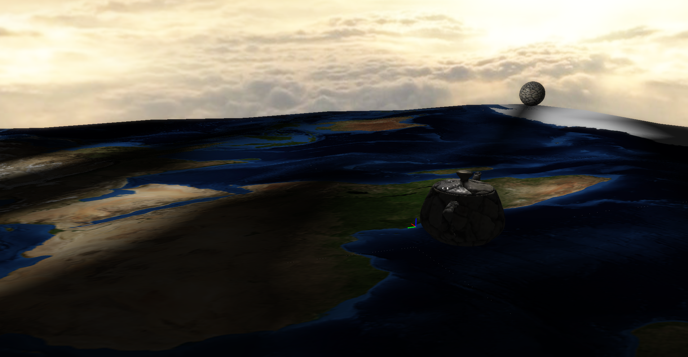
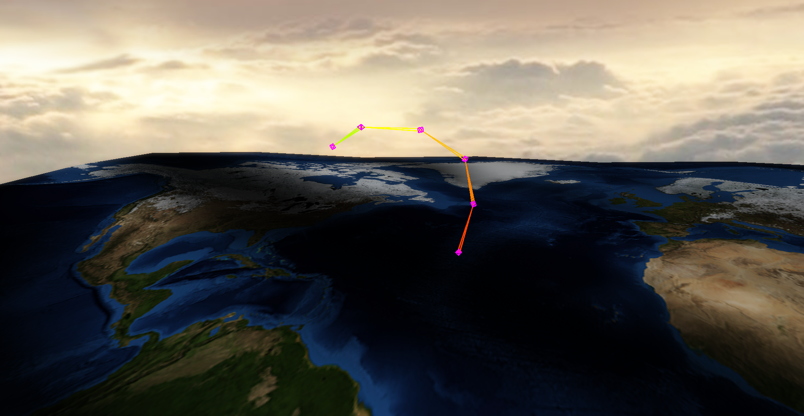
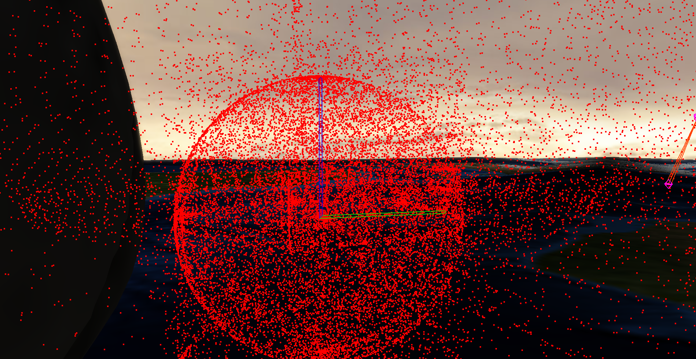
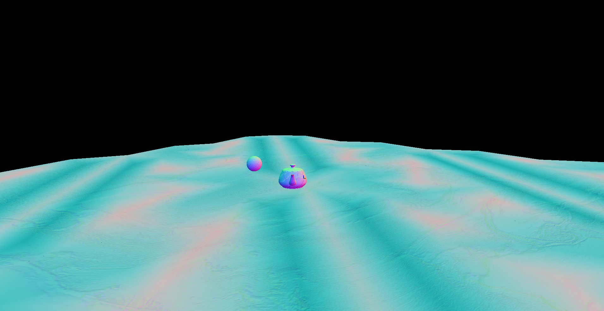
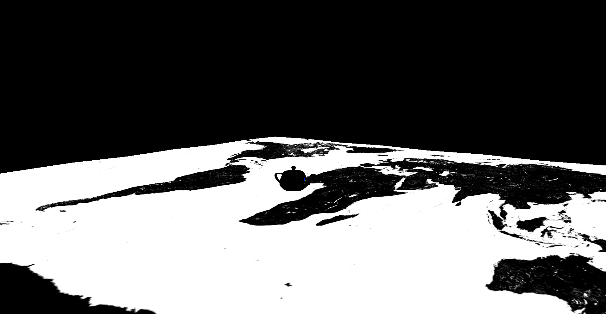
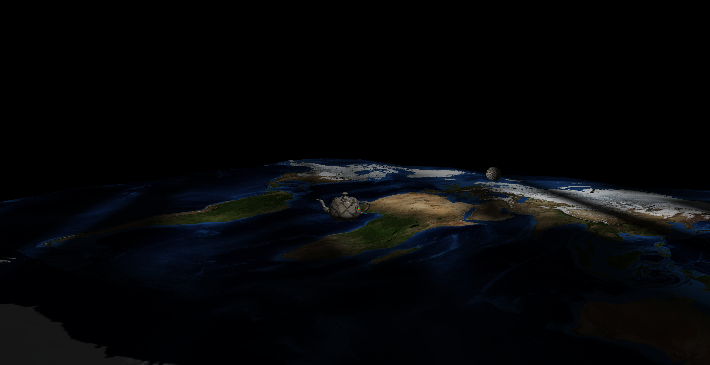
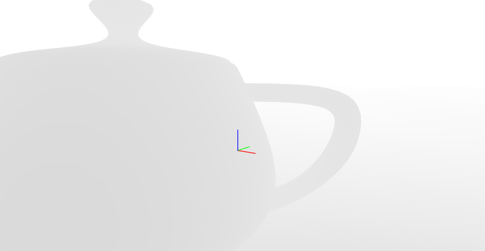

# GPR-300 Final Project

## Water and Compute

### Attribution

Framework, base project by Daniel Buckstein.  
Implementation by Rory Beebout
(See commits for specific contributions)

---

### Description

This demo is an exploration of various concepts in advanced graphics in the playground Animal3D framework by Daniel Buckstein. It is intended to show off a scene displaying "firefly" lights (surrounded by particles) and rain (also particles) over screen-space reflective water, with a tentacle reaching out of the water and thrashing.

---
### Implemented
- **Z-Plane (Ground)**
- * -Set to earth texture
- * * -Normal Mapping
- * * -Height Mapping
- * * -Specular Mapping
- * -Tesselated plane (for smoother displacement)
- * -Displaced vertices up and down in a Sin wave
- **Teapot & Sphere**
- * -Set to stone texture
- * * -Normal Mapping
- * * -Height Mapping
- * * -Specular Mapping
- * * -Parallax Occlusion Mapping
- * -Sphere moves along interpolated CatmullRom curves around scene
- **Tentacle**
- * -Interpolates through 4 poses using forward kinematics
- **Screen Space Reflections**
- * -Updated render pipeline for deferred rendering
- * -Generate reflection based on:
- * * -Scene normals
- * * -Scene depth
- * * -Scene specular
###In-Progress
- **Multiple Lights**
- * -Created Second Light
- **Particles surrounding sphere**
- * -Compute Shaders
- * * -Created VAO to store Particle positions
- * * -Created compute shader to update particle positions
- * * -!!! Cannot read or render particle positions !!!-
        -> Buffer storage likely incorrect
- * * -Created particle fragment and vertex shader for rendering simple particles
###To-Do
- -Compute Shader
- * -Read/Write buffer correctly
- * -Update positions of particles correctly
- * -Add additional particle properties (color, velocity)
- -Multiple Lights
- * Send Light Uniform blocks correctly
- * Adjust shaders to use multiple lights

---

### Instructions

Typical distributed a3D demo.  
Instructions for accessing:  
1. Open "LAUNCH_VS_GL.bat"  
2. Build and Run in Visual Studio  
3. File -> DEBUG: Demo project hot build & load... -> Quick build & load OR Full rebuild & load  

Controls and information are shown within the demo.
The particular scene described in this demo is Scene 6, WATER AND COMPUTE.

---

### Screenshots
Screen Space Reflection

Bloom Composite

Tentacle

VAO Particles (Apparently every vertex in the VAO)

Normal

Specular

Base Color of scenepass

Depth

